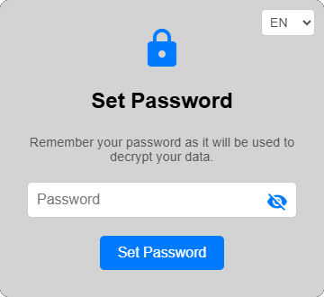
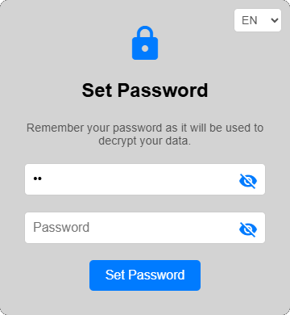
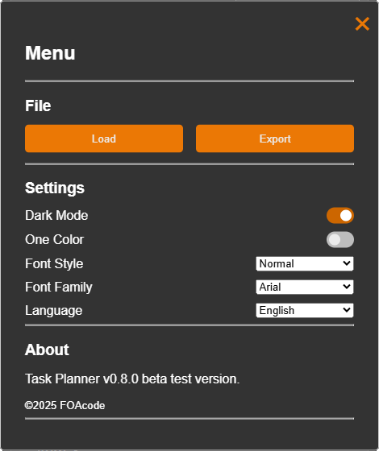
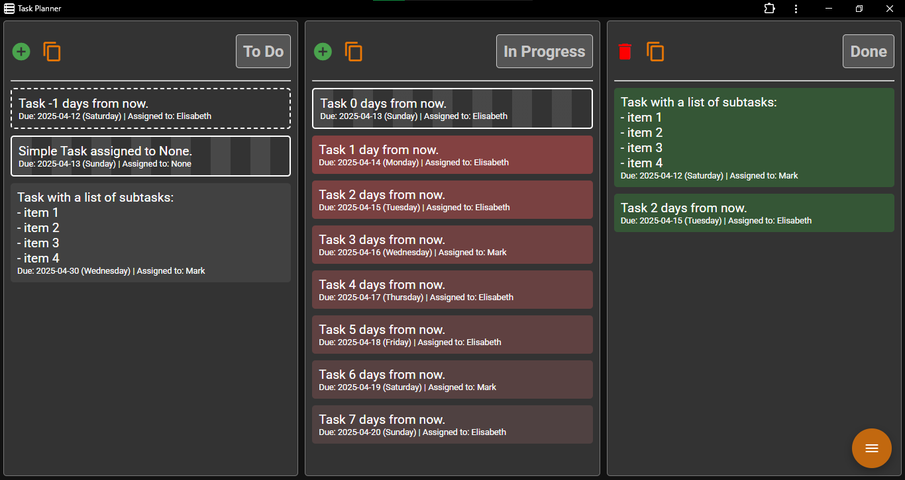

# TaskPlanner
v 0.8.0 
Application is in beta phase. Bugs and instability be present.

A simple and fast way to organise activities locally. Assign a task, due date, person responsible and reorder tasks based on date and importance. 

## Launch 
To launch the application visit the TaskPlanner github page. On chromium based browsers you can install the website as application (PWA).

### Set password
Set a password that will be used for encrypt and unlock the data at every access.

Start typing a password and confirm it in the new field. Remember that your password will be the only way to unlock your data. Write it down and don't lose it.

### Login
At each access provide the previously chosen password to unlock the data from the memory. After 5 wrong tries there will be 5s hold before a new password can be sent.

### Main Screen

### Menu

• Import and Export tasks list
• Toggle ON/OFF Dark Mode
• Toggle ON/OFF One Color mode for tasks
• Choose a Font Style and Family
• Change application language

### Menu (Dark Mode toggle ON)

Click on the floating button positioned in the bottom right corner and click on Dark Mode toggle to turn it on.

The entire application will now be converted in Dark Mode variant.

## Storage
Data is stored within browser cache memory. Therefore make sure to backup your data anytime you wish to clean your browser cache memory.

Don't use Task Planner to store sensible data. If the browser gets compromised your data might not be safe. Also bugs within the application itself might lead to permanent data loss. 
