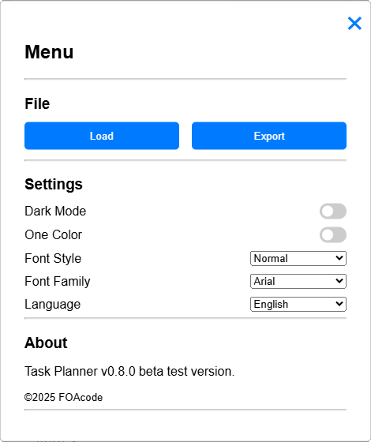

# Task Planner v0.8.0 (Beta)

**Task Planner** is a lightweight and fast local task management tool designed to help you organize activities efficiently.  
This is a **beta release** — bugs and instability may be present.

---

## 🔹 Features
- Organize tasks by due date and importance  
- Assign responsibilities and manage deadlines  
- Store data locally and securely using a password  
- Import/export task lists  
- Toggle Dark Mode and One Color Mode  
- Customize font style and language

---

## 🚀 Launch

To use the application, visit the [Task Planner GitHub Page](https://foacode.github.io/TaskPlanner/).  
On Chromium-based browsers, you can install it as a Progressive Web App (PWA) for a native app experience.

---

## 🔐 Set Password

The application requires a password to encrypt and unlock your data.  
Start by entering and confirming your password. This is the only way to access your stored information.  
**Keep it safe — forgotten passwords cannot be recovered.**

---

## 🔓 Login

At each access, enter your chosen password to decrypt and load your data.  
After **5 incorrect attempts**, the app will introduce a 5-second delay before allowing another try.

---

## 📋 Main Screen

The main interface displays the task list ordered by date and importance. Drag and drop the task from one column to another to change their status. Copy to clipboard the currently displayed column tasks and paste them in chats or other documents. 

---

## ☰ Menu Options

- Import/Export task list  
- Toggle **Dark Mode**  
- Toggle **One Color Mode** for tasks  
- Choose a **Font Style & Family**  
- Change application **language**

---

### 🌙 Dark Mode Example

Enable Dark Mode via the floating action button in the bottom-right corner of the screen.

---

## 💾 Storage

All data is stored in the browser's local cache.  
Please **back up your task list** before clearing your browser cache or data.

> **Warning:**  
> Do not store sensitive information. Although the app encrypts data, if your browser is compromised or the app malfunctions, data may be lost permanently.
